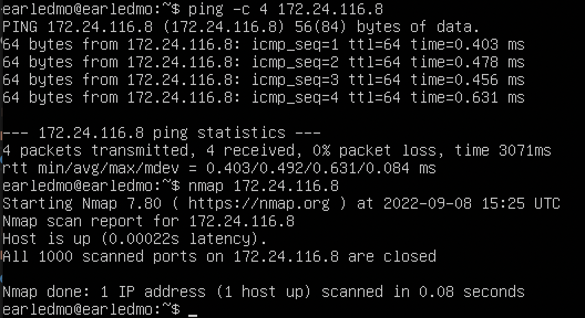
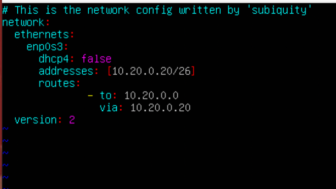

<h1>Linux Network</h1>
<h2>Task 1. Инструмент ipcalc</h2>
<h4>1.1. Сети и маски</h4>
<ol>
<li><strong>Адрес сети 192.167.38.54/13</strong> - 192.160.0.0/13</li>
<li><strong>Перевод маски 255.255.255.0 в префиксную и двоичную запись, /15 в обычную и двоичную, 11111111.11111111.11111111.11110000 в обычную и префикснуюx</li>
<figure>
  
  <figcaption><pre>   <em>Префиксная -</em> 24
      <em>Бинарная -</em> 11111111.11111111.11111111.00000000</figcaption>
</figure>
<figure>
  
  <figcaption><pre>   <em>Обычная -</em> 255.254.0.0
      <em>Бинарная -</em> 11111111.11111110.00000000.00000000</figcaption>
</figure>
<figure>
  
  <figcaption><pre> ipcalc не обрабатывает двоичные значения, поэтому
    мы должны сначала преобразовать значения в десятичные числа.
      <em>Обычная -</em> 255.255.255.240
      <em>Префиксная -</em> 28</figcaption>
</figure>
<li><strong> Минимальный и максимальный хост в сети 12.167.38.4 при масках: /8, 11111111.11111111.00000000.00000000, 255.255.254.0 и /4</strong></li>
<figure>
  
  <figcaption><pre>   <em>минимальный хост -</em> 12.0.0.1
      <em>максимальный хост -</em> 12.255.255.254</figcaption>-
</figure>
<figure>
  
  <figcaption><pre>  поскольку ipcalc не поддерживает двоичные значения в
      качестве входных данных нам нужно преобразовать их в десятичные
      <em>минимальный хост -</em> 12.167.0.1
      <em>максимальный хост -</em> 12.167.255.254</figcaption>
</figure>
<figure>
  
  <figcaption><pre>   <em>минимальный хост -</em> 12.167.38.1
      <em>максимальный хост -</em> 12.167.39.254</figcaption>
</figure>
<figure>
  
  <figcaption><pre>   <em>минимальный хост -</em> 0.0.0.1
      <em>максимальный хост -</em> 15.255.255.254</figcaption>
</figure>
</ol>
<h4>1.2. localhost</h4>
<strong>Доступ к приложению, работающему на локальном хосте, можно получить с помощью следующего IP:</strong>
 <em>127.0.0.2, 127.1.0.1,</em> начиная с 127, что означает, что они зарезервированы для петлевых интерфейсов.
 194.34.23.100, 128.0.0.1 не связаны с локалхостом
<h4>1.3. Диапазоны и сегменты сетей</h4>
<ol>
<li>из перечисленных IP-адресов можно использовать как публичные, так и частные:
<ul>
<li><em>10.0.0.45</em> - private</li>
<li><em>134.43.0.2</em> - public</li>
<li><em>192.168.4.2</em> - private</li>
<li><em>172.20.250.4</em> - private</li>
<li><em>172.0.2.1</em> - public</li>
<li><em>192.172.0.1</em> - public</li>
<li><em>172.68.0.2</em> - public</li>
<li><em>172.16.255.255</em> - private</li>
<li><em>10.10.10.10</em> - private</li>
<li><em>192.169.168.1</em> - public</li>
</ul></li>
<li> из перечисленных IP-адресов шлюза возможны для сети 10.10.0.0/18:
<ul>
<li><em>10.0.0.1</em> - да</li>
<li><em>10.10.0.2</em> - нет</li>
<li><em>10.10.10.10</em> - нет</li>
<li><em>10.10.100.1</em> - нет</li>
<li><em>10.10.1.255</em> - да</li>
</ul></li>
</ol>
<h2>Task 2. Статическая маршрутизация между двумя машинами</h2>
<ul>
<li><strong>Поднимаем 2 виртуальные машины</strong></li>
<li><strong>С помощью команды ip a посмотреть существующие сетевые интерфейсы</strong></li>
<figure>
  
  <figcaption><pre>   <em>ip a</em> машины ws1</figcaption>
</figure>
<figure>
  
  <figcaption><pre>   <em>ip a</em> машины ws2</figcaption>
</figure>

Описать сетевой интерфейс, соответствующий внутренней сети, на обеих машинах
 и задать следующие адреса и маски: ws1 - 192.168.100.10, маска /16, ws2 - 172.24.116.8, маска /12

<li><strong>Установка следующих адресов и маски для: ws1 - 192.168.100.10, маска /16, ws2 - 172.24.116.8, маска /12</strong></li>
<figure>
  
  <figcaption><pre>  <em>sudo netplan apply</em> чтобы установить записанное на ws1</figcaption>
</figure>
<figure>
  
  <figcaption><pre>   <em>sudo netplan apply</em> чтобы установить записанное на ws2</figcaption>
</figure>
</ul>
<h4>2.1.  Добавление статического маршрута вручную</h4>
<ul>
<li><strong>Добавить статический маршрут от одной машины до другой
 и обратно при помощи команды вида <em>ip r add</em></strong></li>
<figure>
  
</figure>
<figure>
  
</figure>
<li><strong>Пропинговать соединение между машинами</strong></li>
<figure>
  
  <figcaption><pre>   пинг от ws1</figcaption>
</figure>
<figure>
  
  <figcaption><pre>   пинг от ws2</figcaption>
</figure>
</ul>
<h4>2.2. Добавление статического маршрута с сохранением</h4>
<ul>
<li><strong>Перезапустить машины</strong></li>
<li><strong>Добавить статический маршрут от одной машины до другой
 с помощью файла etc/netplan/00-installer-config.yaml
</em></strong></li>
<figure>
  
</figure>
<figure>
  
</figure>
<li><strong>Пропинговать соединение между машинами</strong></li>
<figure>
  
  <figcaption><pre>   пинг от ws1</figcaption>
</figure>
<figure>
  
  <figcaption><pre>   пинг от ws2</figcaption>
</figure>
</ul>
<h2>Task 3. Утилита iperf3</h2>
<h4>3.1.  Скорость соединения</h4>
<ul>
<li>8 Mbps = 1 MB/s</li>
<li>100 MB/s = 819200 Kbps</li>
<li>1 Gbps = 1024 Mbps</li>
</ul>
<h4>3.2. Утилита iperf3</h4>
<strong>Измерить скорость соединения между ws1 и ws2</strong>
<figure>
  
  <figcaption><pre>   <em>iperf3</em> на машине ws1</figcaption>
</figure>
<figure>
  
  <figcaption><pre>   <em>iperf3</em> на машине  ws2</figcaption>
</figure>
<h2>Task 4. Сетевой экран</h2>
<h4>4.1. Утилита iptables</h4>
<ul>
<li><strong>Создать файл /etc/firewall.sh, имитирующий фаерволл, на ws1 и ws2:</strong></li>
<figure>
  
  <figcaption><pre>   создание <em>/etc/firewall.sh</em> на машине ws1</figcaption>
</figure>
<figure>
  
  <figcaption><pre>   создание <em>/etc/firewall.sh</em> на машине ws2</figcaption>
</figure>
<li><srong>Запустите файлы на обеих машинах с помощью <em>chmod +x /etc/firewall.sh</em> и <em>/etc/firewall.sh</em> </strong></li>
<figure>
  
  <figcaption><pre>   создание <em>/etc/firewall.sh</em> на машине ws1</figcaption>
</figure>
<figure>
  
  <figcaption><pre>   создание <em>/etc/firewall.sh</em> на машине ws2</figcaption>
</figure>
<li>Первая стратегия (на ws1) разрешает ping, а вторая стратегия (на ws2) запрещает ping.</li>
</ul>
<h4>4.2. Утилита nmap</h4>
<strong>Командой ping найти машину, которая не "пингуется", после чего утилитой nmap показать, что хост машины запущен</strong>
<figure>
  
  <figcaption><pre>  <em>nmap</em> утилита на ws1</figcaption>
</figure>
<figure>
  
  <figcaption><pre>  <em>nmap</em> утилита на ws2</figcaption>
</figure>
<h2>Task 5. Статическая маршрутизация сети</h2>
<strong>Поднять пять виртуальных машин (3 рабочие станции (ws11, ws21, ws22) и 2 роутера (r1, r2))</strong>
<h4>5.1. Настройка адресов машин</h4>
<ul>
<li><strong>Настроить конфигурации машин в etc/netplan/00-installer-config.yaml согласно сети на рисунке.</strong></li>
<figure>
  
  <figcaption><pre>   <em>etc/netplan/00-installer-config.yaml</em> для r1</figcaption>
</figure>
<figure>
  
  <figcaption><pre>   <em>etc/netplan/00-installer-config.yaml</em> для r2</figcaption>
</figure>
<figure>
  
  <figcaption><pre>   <em>etc/netplan/00-installer-config.yaml</em> для ws11</figcaption>
</figure>
<figure>
   
  <figcaption><pre>   <em>etc/netplan/00-installer-config.yaml</em> p. для ws21</figcaption>
</figure>
<figure>
  
  <figcaption><pre>   <em>etc/netplan/00-installer-config.yaml</em> для ws22</figcaption>
</figure>
<li><strong>Перезапустить сервис сети. Если ошибок нет, то командой <em>ip -4 a</em>проверить, что адрес машины , задан верно. </strong></li>
<figure>
  
</figure>
<figure>
  
</figure>
<figure>
  
</figure>
<figure>
  
</figure>
<figure>
  
</figure>
<li><strong>Также пропинговать ws22 с ws21. Аналогично пропинговать r1 с ws11.</strong></li>
<figure>
  
  <figcaption><pre>   ping ws22</figcaption>
</figure>
<figure>
  
  <figcaption><pre>   ping r1</figcaption>
</figure>
</ul>
<h4>5.2. Включение переадресации IP-адресов.</h4>
<ul>
<li><strong>Для включения переадресации IP, выполните команду на роутерах: <em>sysctl -w net.ipv4.ip_forward=1</em></strong></li>
<figure>
  
  <figcaption><pre>   <em>sysctl -w net.ipv4.ip_forward=1</em> ком манда для r1 пид/ / роутера</figcaption>
</figure>
<figure>
  
  <figcaption><pre>   <em>sysctl -w net.ipv4.ip_forward=1</em> ком манда для r2 пид/ / роутера</figcaption>
</figure>
<li><strong>Откройте файл /etc/sysctl.conf и добавьте в него следующую строку: <em>net.ipv4.ip_forward = 1</em></strong></li>
<h4>убейте меня пж</h4>
<figure>
  
</figure>
<figure>
  
</figure>
</ul>
<h4>5.3. Установка маршрута по-умолчанию</h4>
<ul>
<li><strong>Настройте маршрут по умолчанию.</strong></li>
<figure>
  
  <figcaption><pre>   изменение файлов конф во всех</figcaption>
</figure>
<li><strong>Вызвать ip r и показать, что добавился маршрут в таблицу маршрутизации</strong></li>
<figure>
  
  <figcaption><pre>   <em>ip r</em> вот айпи р на всех вызвал все работает</figcaption>
</figure>

<li><strong>Пропинговать с ws11 роутер r2 и показать на r2, что пинг доходит. Для этого использовать команду: <em>tcpdump -tn -i eth1(eth0)</em></strong></li>
<figure>
  
  <figcaption><pre>   ping от r2 до ws11 и обратно</figcaption>
</figure>
</ul>
<h4>5.4. Добавление статических маршрутов</h4>
<ul>
<li><strong>Добавить в роутеры r1 и r2 статические маршруты в файле конфигураций.</strong></li>
<figure>
  
  <figcaption><pre>   добавление статических маршрутов для р1 и р2</figcaption>
</figure>
<li><strong>Вызвать ip r и показать таблицы с маршрутами на обоих роутерах</strong></li>
<figure>
  
  <figcaption><pre>   <em>ip r</em> команда для роутеров</figcaption>
</figure>
<li><strong>Запустить <em>ip r list 10.10.0.0/[netmask]</em> and <em>ip r list 0.0.0.0/0</em> команды на ws11</strong></li>
<figure>
  
  <figcaption><pre>   <em>ip r list</em> команда для ws1</figcaption>
</figure>
</ul>

Для 10.10.0.0/[сетевая маска] был выбран другой маршрут, отличный от 0.0.0.0/0, поскольку в файле конфигурации
 мы определили конкретный маршрут для этого IP

<h4>5.5. Построение списка маршрутизаторов</h4>
<ul>
<li><strong>Запустить на r1 команду дампа</li><figure>
  
  <figcaption><pre>   <em>tcpdump -tnv -i eth0</em> команда для r1</figcaption>
</figure>
<li>При помощи утилиты traceroute построить список маршрутизаторов на пути от ws11 до ws21</strong></li>
<figure>
  
  <figcaption><pre>   <em>traceroute</em> на машине ws11</figcaption>
</figure>
</ul>

Построение пути в traceroute начинается с точки назначения и идет в обратном направлении к источнику.

<h4>5.6. Использование протокола ICMP при маршрутизации</h4>
<ul>
<li><strong>Запустить на r1 перехват сетевого трафика, проходящего через eth0 с помощью команды</strong></li>
<li><strong>Пропинговать с ws11 несуществующий IP (например, 10.30.0.111) с помощью команды:</strong></li>
<figure>
  
  
  <figcaption><pre>   <em>tcpdump -n -i eth0 icmp</em> команда для выхода после пинга с ws11</figcaption>
</figure>
</ul>
<h2>Task 6. Динамическая настройка IP с помощью DHCP</h2>
<ul>
<li><strong>Для r2 настроить в файле /etc/dhcp/dhcpd.conf конфигурацию службы DHCP:</strong>
<ul>
<li> указать адрес маршрутизатора по-умолчанию, DNS-сервер и адрес внутренней сети.</li>
<figure>
  
  <figcaption><pre>   <em>/etc/dhcp/dhcpd.conf</em> конфигурация для машины r2</figcaption>
</figure>
<li> в файле resolv.conf прописать nameserver 8.8.8.8.</li>
<figure>
  
  <figcaption><pre>   <em>resolv.conf</em> изменение файлов для машины r2</figcaption>
</figure>
</li>
<li><strong>Перезагрузить службу DHCP командой systemctl restart isc-dhcp-server</em>. Машину ws21 перезагрузить при помощи reboot и через ip a показать, что она получила адрес.</strong></li>
<figure>
  
  <figcaption><pre>   <em>ip a</em> и systemctl restart isc-dhcp-server на r2</figcaption>
</figure>
<li>Также пропинговать ws22 с ws21.</li>
<figure>
  
</figure>
<li>Указать MAC адрес у ws11, для этого в etc/netplan/00-installer-config.yaml надо добавить строки: macaddress: 10:10:10:10:10:BA, dhcp4: true</em></li>
<figure>
  
</figure>
<li><strong>Для r1 настроить аналогично r2, но сделать выдачу адресов с жесткой привязкой к MAC-адресу (ws11)</strong></li>
<figure>
  
  
</figure>
<li><strong>Рестарт DHCP сервер</strong></li>
<figure>
  
  <figcaption><pre>   <em>systemctl restart isc-dhcp-server</em> для рестарта r1</figcaption>
</figure>
<li><strong>Перезагрузите ws11 и покажите с помощью ip a, что у него есть адрес</strong></li>
<figure>
  
</figure>
<li><strong>Ping r1 from ws11</strong></li>
<figure>
  
</figure>
<li><strong>Запросить обновление IP-адреса от ws21</strong></li>
<figure>
  
   
  <figcaption><pre> Чтобы получить новый адрес для машинного интерфейса, мы используем команды <em>sudo dhclient -r (release) и sudo dhclient</em></figcaption>
</figure>
</ul>
<h2>Task 7. NAT</h2>
<ul>
<li><strong>В файле /etc/apache2/ports.conf на ws22 и r1 изменить строку Listen 80 на Listen 0.0.0.0:80, то есть  сделать сервер Apache2 общедоступным
</strong></li>
<figure>
  
</figure>
<li><strong>Запустить веб-сервер Apache командой service apache2 start на ws22 и r1</strong></li>
<figure>
  
</figure>
<li><strong>Добавить в фаервол, созданный по аналогии с фаерволом из Части 4, на r2 следующие правила:</strong></li>
<ol>
<li>1) Удаление правил в таблице filter - iptables -F</li>
<li>2) Удаление правил в таблице "NAT" - iptables -F -t nat</li>
<li>3) Отбрасывать все маршрутизируемые пакеты - iptables --policy FORWARD DROP</li>
<figure>
  
</figure>
</ol>
<li><strong>Запуск <em>firewall.sh</em></strong></li>
<figure>
  
</figure>
<li><strong>Проверить соединение между ws22 и r1 командой ping</strong></li>
<figure>
  
</figure>
<li><strong>Добавить в файл ещё одно правило:</strong></li>
 4) Разрешить маршрутизацию всех пакетов протокола ICMPs
<figure>
  
</figure>
<li><strong>Добавить в файл ещё два правила:
<ul>
<li>Включить SNAT</li>
<li>Включить DNAT на 8080 порт машины r2 и добавить к веб-серверу Apache, запущенному на ws22, доступ извне сети</li>
<figure>
  
</figure>
</ul>
<li><strong>Запускать файл также, как в Части 4</strong></li>
<li><strong>Проверить соединение по TCP для SNAT, для этого с ws22 подключиться к серверу Apache на r1 командой:</strong></li>
<figure>
  
</figure>
<li><strong>Проверить соединение по TCP для DNAT, для этого с r1 подключиться к серверу Apache на ws22 командой telnet (обращаться по адресу r2 и порту 8080)
</strong></li>
<figure>
  
</figure>

<h2>Task 8. Знакомство с SSH Tunnels</h2>
<ul>
<li><strong>Запустить веб-сервер Apache на ws22 только на localhost</strong>
<figure>
  
</figure>
<li><strong>Воспользоваться Local TCP forwarding с ws21 до ws22, чтобы получить доступ к веб-серверу на ws22 с ws21</strong>
<figure>
  
</figure>
<li><strong><li><strong>Воспользоваться Local TCP forwarding с ws21 до ws22, чтобы получить доступ к веб-серверу на ws22 с ws21</strong></strong>
<figure>
  
</figure>
<li><strong><li><strong>Для проверки, сработало ли подключение в обоих предыдущих пунктах, перейдите во второй терминал и выполните команду: telnet 127.0.0.1 [локальный порт]</strong></strong>
<figure>
  
</figure>
<figure>
  
</figure>